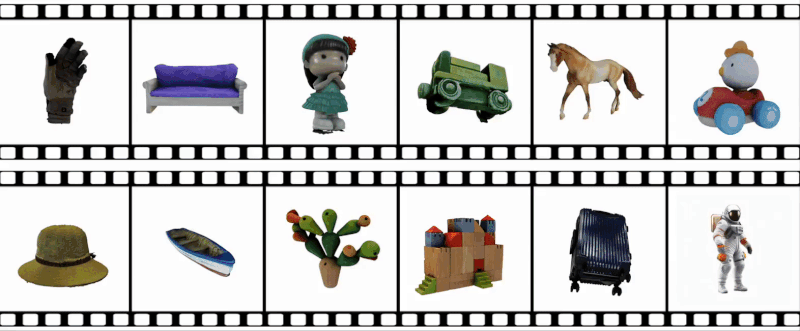
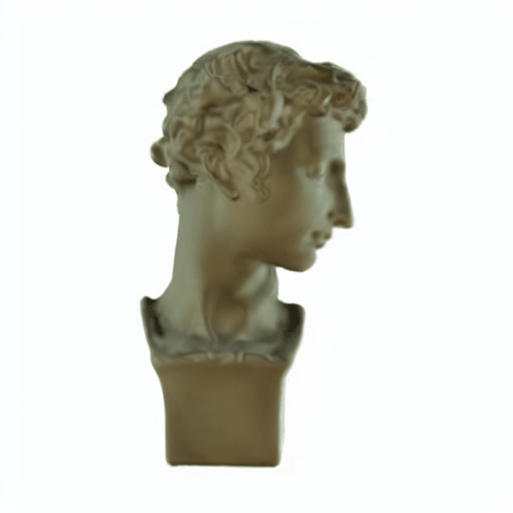
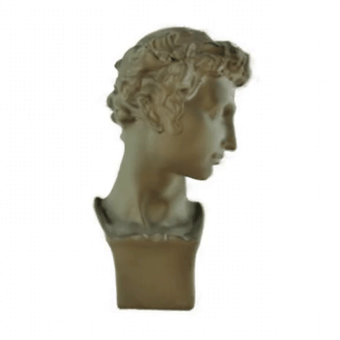

# SV3D-diffusers



This repo provides scripts about:

1. Spatio-temporal UNet (`SV3DUNetSpatioTemporalConditionModel`) and pipeline (`StableVideo3DDiffusionPipeline`) modified from [SVD](https://github.com/huggingface/diffusers/blob/main/src/diffusers/pipelines/stable_video_diffusion/pipeline_stable_video_diffusion.py) for [SV3D](https://sv3d.github.io) in the [diffusers](https://github.com/huggingface/diffusers) convention.

2. Converting the [Stability-AI](https://github.com/Stability-AI/generative-models)'s [SV3D-p UNet checkpoint](https://huggingface.co/stabilityai/sv3d) to the [diffusers](https://github.com/huggingface/diffusers) convention.

3. Infering the `SV3D-p` model with the [diffusers](https://github.com/huggingface/diffusers) library to synthesize a 21-frame orbital video around a 3D object from a single-view image (preprocessed by removing background and centering first).

Converted SV3D-p checkpoints have been uploaded to HuggingFace🤗 [chenguolin/sv3d-diffusers](https://huggingface.co/chenguolin/sv3d-diffusers).


## 🔥 See Also

You may also be interested in our works:
- [**[ICLR 2025] DiffSplat**](https://github.com/chenguolin/DiffSplat): generate 3D objects in 3DGS directly by fine-tuning a text-to-image models.
- [**[NeurIPS 2024] HumanSplat**](https://github.com/humansplat/humansplat): SV3D is fine-tuned on human datasets for single-view human reconstruction.


## 🚀 Usage
```bash
git clone https://github.com/chenguolin/sv3d-diffusers.git
# Please install PyTorch first according to your CUDA version
pip3 install -r requirements.txt
# If you can't access to HuggingFace🤗, try:
# export HF_ENDPOINT=https://hf-mirror.com
python3 infer.py --output_dir out/ --image_path assets/images/sculpture.png --elevation 10 --half_precision --seed -1
```
The synthesized video will save at `out/` as a `.gif` file.


## 📸 Results
> Image preprocessing and random seed for different implementations are different, so the results are presented only for reference.

| Implementation | sculpture |  bag   | kunkun |
| :------------- | :------:  | :----: | :----: |
| **SV3D-diffusers (Ours)** |  |  |  |
| **Official SV3D**  |  |  |  |


## 📚 Citation
If you find this repo helpful, please consider giving this repository a star 🌟 and citing the original SV3D paper.
```
@inproceedings{voleti2024sv3d,
   author={Voleti, Vikram and Yao, Chun-Han and Boss, Mark and Letts, Adam and Pankratz, David and Tochilkin,  Dmitrii and Laforte, Christian and Rombach, Robin and Jampani, Varun},
   title={{SV3D}: Novel Multi-view Synthesis and {3D} Generation from a Single Image using Latent Video Diffusion},
   booktitle={European Conference on Computer Vision (ECCV)},
   year={2024},
}
```
